# Langflow Example - Product Data Emitter

## Overview

The **Product Data Emitter** is a Python-based application designed to simulate updates to product data dynamically and store the updated data in GridGain's vector stores. It leverages LangChain's `OpenAIEmbeddings` model for embedding generation and feeds the product content along with the vectors generated by the embedding model to the GridGain Vector Store.

---

## Documentation

For the up-to-date Langflow integration documentation, visit the [GridGain docs](https://gridgain.com/docs/extensions/vector/langflow#using-early-access-version).

---

## Features

- **Predefined Product Updates**: Updates the availability, price, and delivery time of predefined products.
- **GridGain Integration**: Uses GridGain for vector storage.
- **LangChain Integration**: Leverages LangChain's embeddings for vectorization.
- **Initial Data Load**: Adds data to the GridGain Vector store.
- **Dynamic Data Emission**: Emits product data updates to simulate real-time updates.
- **API Key-Based Configuration**: Uses OpenAI API keys for initializing embeddings.

---

## Prerequisites

### Software and Libraries
1. Python 3.11.7+
2. A running GridGain Enterprise or Ultimate Edition, at least 8.9.17 ([release notes](https://www.gridgain.com/docs/latest/release-notes/8.9.17/release-notes_8.9.17))
   - Make sure your license includes access to the vector search feature.
   - If you see any error about gridgain-vector-query or vector search not enabled, you need to enable it by moving libs/optional/gridgain-vector-query to the libs/ folder
3. OpenAI API key
   1. Visit https://platform.openai.com/signup
   2. Create an account (or sign in if you already have one)
   3. Once logged in, go to the Settings->API section: https://platform.openai.com/settings/organization/api-keys
   4. Click "Create new secret key"
   5. Add your billing information (required for API access)
   6. Make sure to copy and save your API key immediately after creation - you won't be able to see it again after leaving the page
   7. If you’re seeing quota issues with respect to OpenAI, you need to purchase OpenAI credits

---

## Setup

### 1. Langflow Example Application Setup

1. **Clone the repository**:
   ```bash
   git clone https://github.com/GridGain-Demos/langflow_example.git
   cd langflow_example

   python3.11 -m venv .venv
   .venv\Scripts\activate

   ```

2. **Install dependencies**:
   ```bash
   pip install -r requirements.txt
   ```


### 2. Langflow Early Access Repository Setup
**Get the Early Access Langflow version:**

* Download the latest version from the [GridGain website](https://www.gridgain.com/media/langflow/langflow-1.1.13.gridgain.2.zip).
* Unpack the downloaded archive.

For details on setting up your local environment:
Detailed instructions are available in the DEVELOPMENT.md file within the zip file.

The following steps are excerpts from the DEVELOPMENT.md file.

1. **Install Pre-Requisites:**

   - **Operating System:** macOS or Linux; Windows users MUST develop under WSL.

   - **git:** The project uses the ubiquitous git tool for change control.- make: The project uses make to coordidinate packaging.
   
   - **uv:** This project uses uv (>=0.4), a Python package and project manager from Astral. Install instructions at https://docs.astral.sh/uv/getting-started/installation/.
   
   - **npm:** The frontend files are built with Node.js (v22.12 LTS) and npm (v10.9). Install instructions at https://nodejs.org/en/download/package-manager.
   
      - Windows (WSL) users: ensure npm is installed within WSL environment; which npm should resolve to a Linux location, not a Windows location.
      - WSL users: ensure to use system IP as host for Gridgain connection in Langflow UI

2. **Initialize and Run Langflow**:

   This runs perfectly for macOS and Linux, but for windows you will need WSL setup.

   ```bash
   make init
   ```
   This command performs the following operations:
   - Installs backend dependencies
   - Installs frontend dependencies
   - Builds frontend static files
   - Initializes the project
   - Starts the application using `uv run langflow run`

   ```
   ╭───────────────────────────────────────────────────────────────────╮
   │ Welcome to ⛓ Langflow                                            │ 
   │                                                                   │
   │                                                                   │
   │ Collaborate, and contribute at our GitHub Repo 🌟                 │
   │                                                                   │
   │ We collect anonymous usage data to improve Langflow.              │
   │ You can opt-out by setting DO_NOT_TRACK=true in your environment. │
   │                                                                   │
   │ Access http://127.0.0.1:7860                                      │
   ╰───────────────────────────────────────────────────────────────────╯
   ```

---

## Running the Example

### 1. Running the Langflow Example Application

In the **Langflow Example** project, run the following command:

```bash
cd src
python main.py --use_api_key <YOUR_API_KEY> --num_products <NUMBER> --interval <INTERVAL_IN_SECONDS> [--load_data <true|false>] [--json_file <PATH_TO_JSON_FILE>]
```
 - [GridGain Enterprise must be running locally](#software-and-libraries)

### Arguments
- `--use_api_key`: (Required) OpenAI API key for embedding initialization.
- `--num_products`: (Optional) Number of products to emit. Default is 20.
- `--interval`: (Optional) Time interval (in seconds) between emissions. Default is 5.
- `--load_data`: (Optional) Load initial product data. Default is `false`.
- `--json_file`: (Optional) Path to a JSON file containing initial product data.

### Example Command
```bash
python main.py --use_api_key YOUR_API_KEY --num_products 10 --interval 10 --load_data true --json_file "data/products.json"
```

### 2. Ensure your Langflow is up and running:

Wait for Langflow to initialize. Once initialized, it will show a box with the URL: http://127.0.0.1:7860/all.

## Import pre-designed Flow

Once langflow is up and running, import the predesigned flow from the assets folder directly in langflow as follows:

 - Step 1: Access the UI at: http://127.0.0.1:7860/all and click on create a new flow
   
   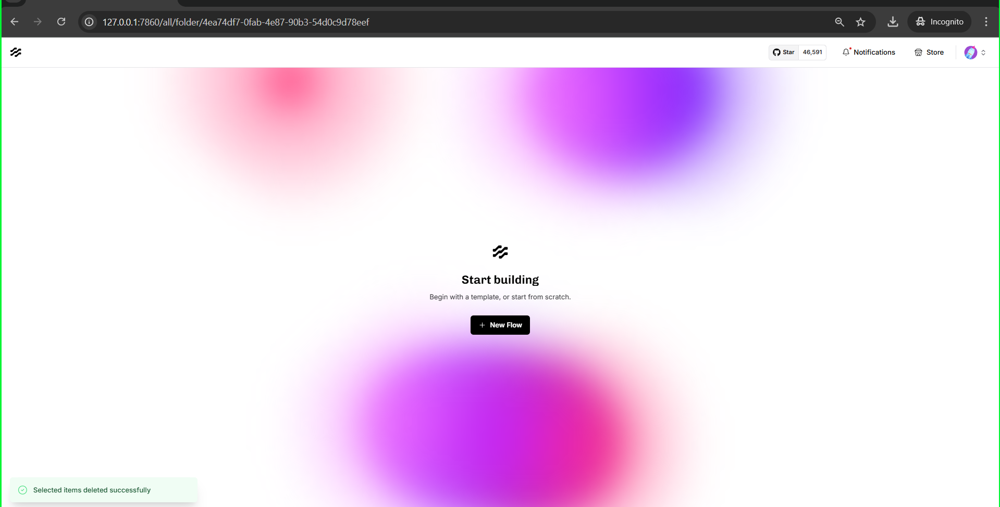

 - Step 2: Create a blank flow
   
   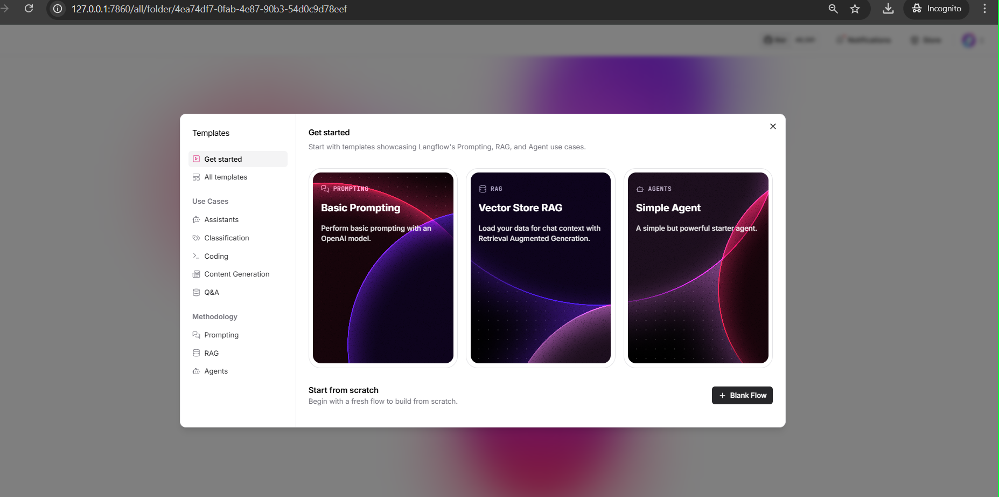

 - Step 3: Go back to my projects
   
   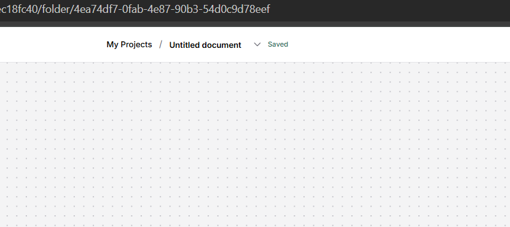

 - Step 4: Click on the upload button next to folders

    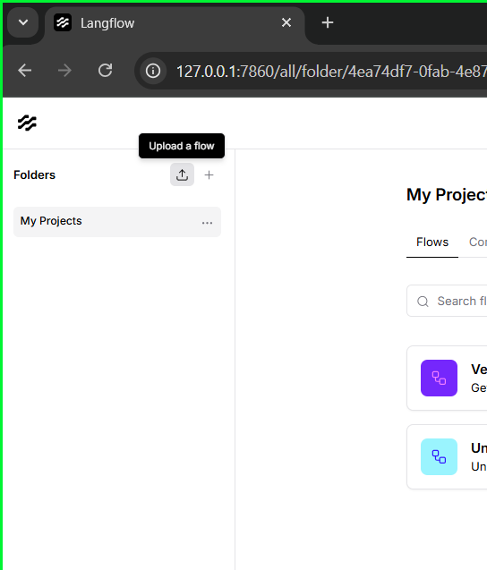

 - Step 5: Select the Gridgain Vector Store RAG json file from the assets folder and import
   
   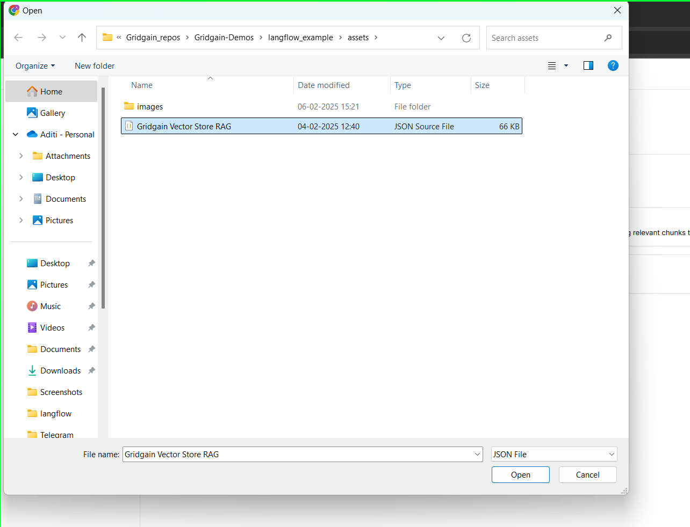

 - Step 6: Click on the newly Imported Project

   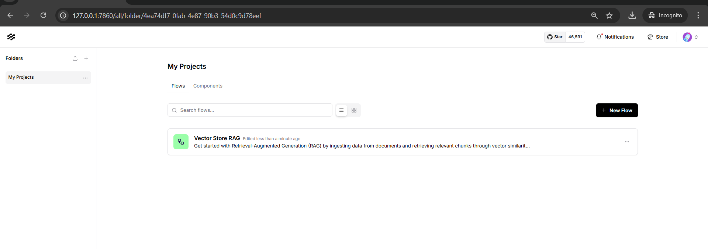

 - Step 7: The following flow would get loaded

   

 - Step 8: Add the OpenAI Key Variable in the OpenAI Embeddings Component
 
   [You can generate Your OPENAI Key here](#software-and-libraries)

   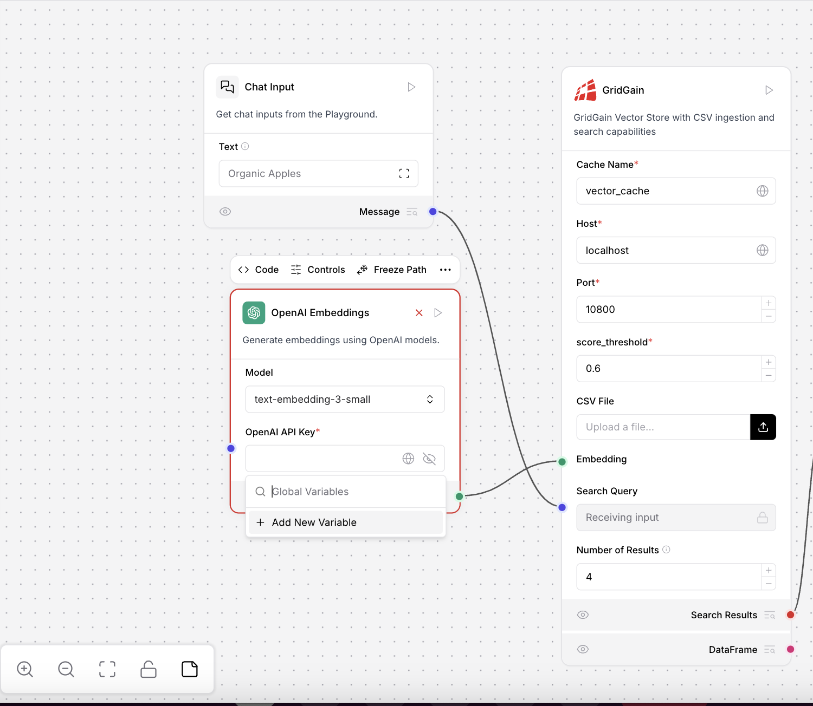

 - Step 9: Create a new Variable, and add your key and save

   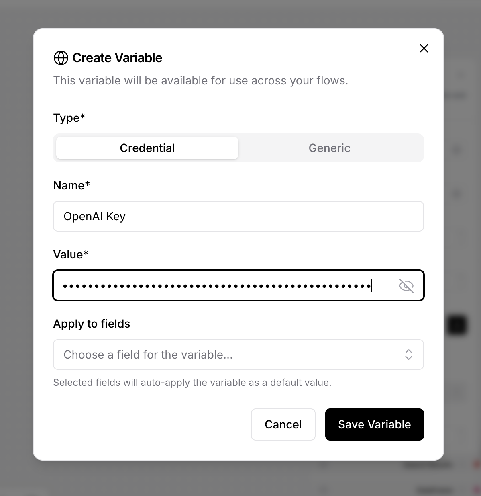

 - Step 10: Select the key from the dropdown

   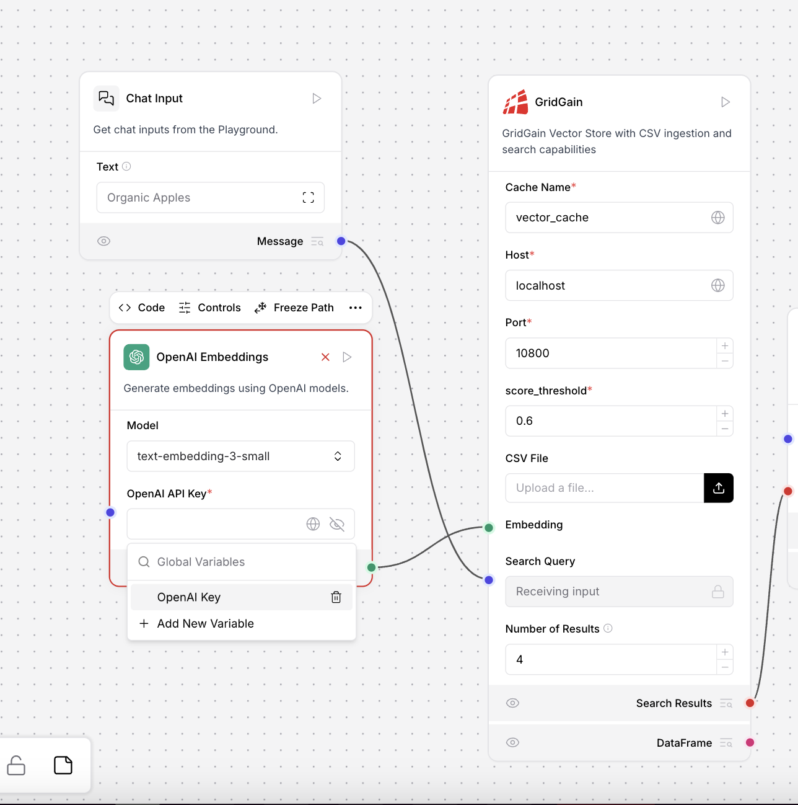

 - Step 11: Select the same variable for the OpenAI LLM component just before the Chat Output

   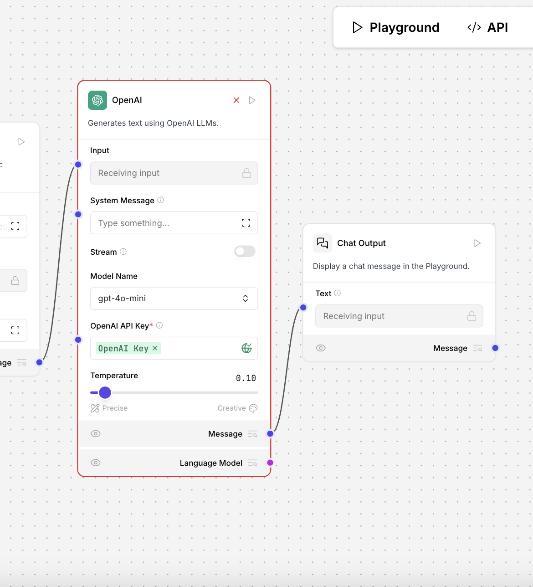

 - Step 12: Once the variables are set, click on the Playground button
   
   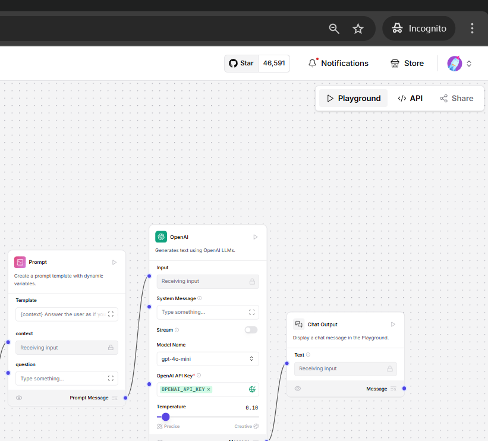

 - Step 13: The Chat window should get loaded, where you can add your queries, like:
   1. Organic Apple
   2. Organic Bananas

   

---

## How It Works

**Block Diagram of workflow**

**Architecture:**


1. **Initialization**:
   - Connects to GridGain at `localhost:10800`.
   - Initializes OpenAI embeddings and GridGain stores.

2. **Dynamic Product Updates**:
   - Randomly selects predefined products.
   - Simulates updates to price, availability, and delivery time.
   - Updates data in the key-value and vector stores.

3. **Data Storage**:
   - Key-value store: Stores structured product information.
   - Vector store: Stores product embeddings for semantic search.

4. **Components:**

   - **GridGain Vector Store:** 
   
      A vector store implementation that provides:

      - Document storage and similarity search
      - CSV file ingestion with automatic document processing
      - Configurable similarity search with score thresholds
      - Metadata handling for documents

      **Key features:**
      
      - Simple connection configuration with host/port settings
      - CSV processing with title and text field support
      - Automatic metadata extraction from CSV files
      - Configurable number of search results

   - **GridGain Chat Memory**
   
      A chat memory component that stores conversation history in GridGain:

      **Key features:**
      
      - Persistent storage of chat messages across sessions
      - Support for multiple message types (Human, AI, System, Chat)
      - JSON serialization for efficient storage and retrieval
      - Session-based message management

---
