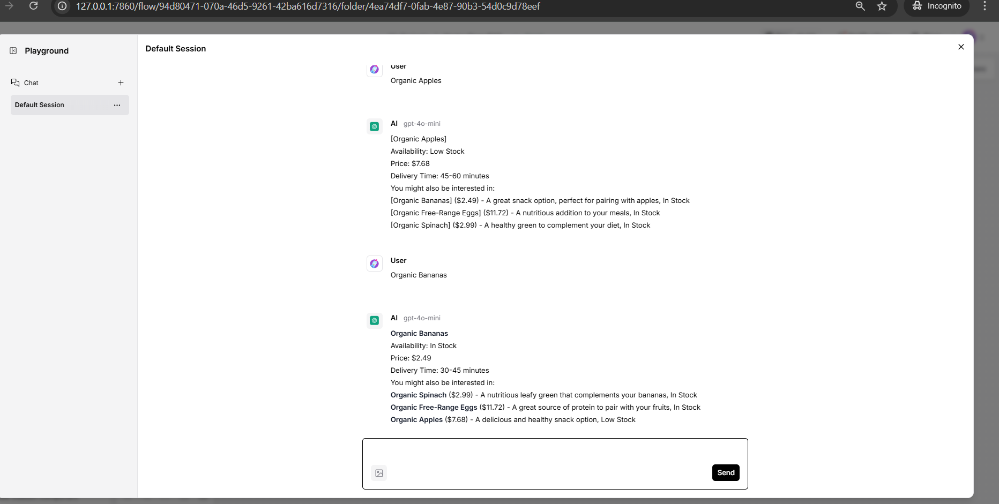

# Langflow Example - Product Data Emitter

## Overview

The **Product Data Emitter** is a Python-based application designed to simulate updates to product data dynamically and store the updated data in GridGain's key-value and vector stores. It leverages LangChain's `OpenAIEmbeddings` for embedding generation and integrates with GridGain for managing and querying product data efficiently.

---

## Documentation

For the up-to-date Langflow integration documentation, visit the [GridGain docs](https://gridgain.com/docs/extensions/vector/langflow#using-early-access-version).

---

## Features

- **Predefined Product Updates**: Updates the availability, price, and delivery time of predefined products.
- **GridGain Integration**: Uses GridGain for both key-value storage and vector storage.
- **LangChain Integration**: Leverages LangChain's embeddings for vectorization.
- **Dynamic Data Emission**: Emits product data at regular intervals to simulate real-time updates.
- **API Key-Based Configuration**: Uses OpenAI API keys for initializing embeddings.
- **Command-Line Interface**: Configurable parameters for flexibility.
- **Langflow Integration**: Includes integration with Langflow for enhanced workflow management.

---

## Prerequisites

### Software and Libraries
- Python 3.10+
- GridGain
- LangChain
- OpenAI API Key
- Node.js (for Langflow)
- uv (>=0.4) (for Langflow)
- Required Python packages (install via `requirements.txt`)

---

## Installation

### 1. Core Application Setup

1. **Clone the repository**:
   ```bash
   git clone https://github.com/GridGain-Demos/langflow_example.git
   cd langflow_example

   python -m venv .venv
   .venv\Scripts\activate

   ```

2. **Install dependencies**:
   ```bash
   pip install -r requirements.txt
   ```


### 2. Langflow Setup
**Get the Early Access Langflow version:**

* Download the latest version from the [GridGain website](https://www.gridgain.com/media/langflow/langflow-1.1.13.gridgain.1.zip).
* Unpack the downloaded archive.

#### For Windows:


1. **Prepare Environment**:
   ```bash
   python -m venv .venv
   .venv/Scripts/activate
   ```

2. **Update local env:**

    Create **.local.env** file 
    ```bash
    LANGFLOW_DATABASE_URL="sqlite:///./langflow.db"
    LANGFLOW_AUTO_LOGIN=true
    LANGFLOW_HOST=127.0.0.1
    LANGFLOW_PORT=7860
    LANGFLOW_FRONTEND_PATH="./src/frontend/build"
    ```

2. **Install Langflow and Dependencies:**
   ```bash
   pip install -e .
   cd src/backend/base
   pip install -e .
   cd ../../..
   ```

3. **Frontend:**

   Navigate to the frontend directory and install dependencies:
   ```
   cd src/frontend
   npm install
   npm run build
   ```

#### For MAC:

1. **Initialize Development Environment**:
   ```bash
   make init
   ```
   This command sets up the environment by:
   - Installing backend and frontend dependencies
   - Building frontend static files
   - Initializing the project

2. **Run Locally**:
   ```bash
   # For backend
   make backend
   
   # For frontend
   make frontend
   ```

### 3. Run Langflow:

Then, Run the following command in terminal:

```bash
uv run langflow run --env-file .local.env
```
Access the UI at: http://127.0.0.1:7860/all

---

## Usage

### Running the Application
Execute the script using:
```bash
cd src
python main.py --use_api_key <YOUR_API_KEY> --num_products <NUMBER> --interval <INTERVAL_IN_SECONDS> [--load_data <true|false>] [--json_file <PATH_TO_JSON_FILE>]
```

### Arguments
- `--use_api_key`: (Required) OpenAI API key for embedding initialization.
- `--num_products`: (Optional) Number of products to emit. Default is 20.
- `--interval`: (Optional) Time interval (in seconds) between emissions. Default is 5.
- `--load_data`: (Optional) Load initial product data. Default is `false`.
- `--json_file`: (Optional) Path to a JSON file containing initial product data.

### Example Command
```bash
python main.py --use_api_key YOUR_API_KEY --num_products 10 --interval 10 --load_data true --json_file "data/products.json"
```

---

## File Structure

```
|-- src/
   |-- data/
      |-- products.json                  # Example initial product data
   |-- main.py                           # Main application script
   |-- data_loader.py                    # Handles initial data loading to GridGain
   |-- utils.py                          # Utility functions for connections and initialization
|-- assets/
   |-- images/
      |-- LANGFLOW-CHAT-AI.png           
      |-- LANGFLOW-UI.png
      |-- MERMAID.png                    # Example diagrams 
    |-- Gridgain Vector Store RAG.json
|-- requirements.txt                     # Python dependencies
|-- README.md                           # Documentation file
```

---

## How It Works

1. **Initialization**:
   - Connects to GridGain at `localhost:10800`.
   - Initializes OpenAI embeddings and GridGain stores.

2. **Dynamic Product Updates**:
   - Randomly selects predefined products.
   - Simulates updates to price, availability, and delivery time.
   - Updates data in the key-value and vector stores.

3. **Data Storage**:
   - Key-value store: Stores structured product information.
   - Vector store: Stores product embeddings for semantic search.

4. **Components:**

   - **GridGain Vector Store:** 
   
      A vector store implementation that provides:

      - Document storage and similarity search
      - CSV file ingestion with automatic document processing
      - Configurable similarity search with score thresholds
      - Metadata handling for documents

      **Key features:**
      
      - Simple connection configuration with host/port settings
      - CSV processing with title and text field support
      - Automatic metadata extraction from CSV files
      - Configurable number of search results

   - **GridGain Chat Memory**
   
      A chat memory component that stores conversation history in GridGain:

      **Key features:**
      
      - Persistent storage of chat messages across sessions
      - Support for multiple message types (Human, AI, System, Chat)
      - JSON serialization for efficient storage and retrieval
      - Session-based message management

---
**Block Diagram of workflow**

**Mermaid diagram:**


**Langflow UI flow**


**Langflow AI Chat**



---

## Key Functions

### `main.py`
- **`generate_product_data`**: Randomly generates updates for predefined products.
- **`update_product_data`**: Updates product data in both key-value and vector stores.
- **`main`**: Main entry point for running the product emitter.

---

<!-- ## Contributions

Feel free to fork this repository and contribute by submitting pull requests.

--- -->
